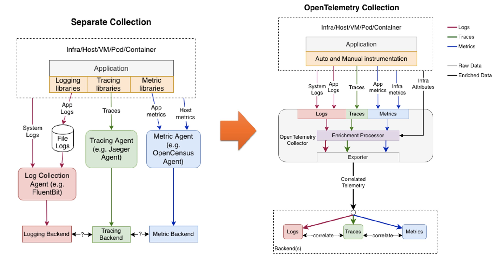

 
我对open-telemetry的一次调研记录

## brief 摘要

OpenTracing主要且也仅侧重于Trace方面，而OpenTelemetery主要涵盖了三个部分：Trace、Metrics、Log

**Opentelemetry 项目组成**

> OpenTelemetry is developed on a signal by **signal basis**. **Tracing, metrics, baggage, and logging** are examples of signals. Signals are built **on top of context propagation**, a shared mechanism for correlating data across distributed systems.

## Signals 信号源

> The purpose of OpenTelemetry is to **collect, process, and export [signals](https://opentelemetry.io/docs/specs/otel/glossary/#signals).**
>
> OpenTelemetry currently supports **[traces](https://opentelemetry.io/docs/concepts/signals/traces), [metrics](https://opentelemetry.io/docs/concepts/signals/metrics), [logs](https://opentelemetry.io/docs/concepts/signals/logs) and [baggage](https://opentelemetry.io/docs/concepts/signals/baggage).** 

- "Signal" 这个术语并不是指一个特定的组件或实体，而是一种通用的概念，用于表示**不同类型的观测数据**。

- 其中 Baggage 不是一个可观察性工具，它是一个将任意键和值附加到事务中的系统，以便下游服务可以访问它们。因此，Baggage 没有 OTLP 或收集器组件。

- 跟踪（tracing）、度量（metrics）和日志（logs）可以同时使用，形成一个全面的观测解决方案。

- 

- 传统架构下Logs、Traces、Metrics都是单独产生并收集的，在OpenTelemetry的规划中，所有的数据都会通过OpenTelemetry的Collector进行采集并传输到统一的后端进行关联。好处非常明显：

  1. 应用只需要一个SDK就可以做所有可观测性上的事情，依赖更少、资源消耗也更小
  2. 采集端只需要一个，部署和运维代价更低
  3. 数据格式统一，数据关联更容易

  可以在这里查看官方对这四个signal的[支持情况](https://opentelemetry.io/docs/specs/status/#current-status)

- 每个信号源都有[ 四个核心组件](https://opentelemetry.io/docs/concepts/components/):

  - APIs

  - SDKs

  - [OpenTelemetry Protocol](https://opentelemetry.io/docs/specs/otlp/) (OTLP) 

  - [Collector](https://opentelemetry.io/docs/collector/)

- 信号源还具有 contrib 组件，即<u>plugins</u>和<u>instrumentations(仪器：用于在应用程序代码中自动仪器化跟踪和度量的工具和库)</u>的**生态系统**。共享相同的语义约定，以确保它们在观察常见操作（例如 HTTP 请求）时生成相同的数据。

## Components 组件

> OpenTelemetry is currently made up of several main components:
>
> - [Specification](https://opentelemetry.io/docs/concepts/components/#specification)
> - [Collector](https://opentelemetry.io/docs/concepts/components/#collector)
> - Language-specific API & SDK implementations
>   - [Instrumentation Libraries](https://opentelemetry.io/docs/concepts/components/#instrumentation-libraries)
>   - [Exporters](https://opentelemetry.io/docs/concepts/components/#exporters)
>   - [Automatic Instrumentation](https://opentelemetry.io/docs/concepts/components/#automatic-instrumentation)
>   - [Resource Detectors](https://opentelemetry.io/docs/concepts/components/#resource-detectors)
>   - [Cross Service Propagators](https://opentelemetry.io/docs/concepts/components/#cross-service-propagators)
>   - [Sampler](https://opentelemetry.io/docs/concepts/components/#sampler)
> - [K8s operator](https://opentelemetry.io/docs/concepts/components/#k8s-operator)
> - [Function as a Service assets](https://opentelemetry.io/docs/concepts/components/#function-as-a-service-assets)

### Specification **跨语言规范说明**

描述所有实现的跨语言要求和期望。除了术语定义之外，该规范还定义了以下内容：

- **API：**定义用于生成和关联跟踪、指标和日志记录数据的数据类型和操作。
- **SDK：**定义特定于语言的 API 实现的要求。配置、数据处理和导出概念也在这里定义。
- **数据：**定义遥测后端可以提供支持的开放遥测协议 (OTLP) 和与供应商无关的语义约定。

### 特定语言的 APIs 和 SDKs 实现

OpenTelemetry 还具有语言 SDK，以便开发人员能够在各种语言中集成观测功能。

每个语言的 API 提供了开发人员在应用程序中使用观测功能的标准接口，而相应的 SDK 实现则提供了这些接口的具体实现和底层逻辑。Instrumentation Libraries 自动化工具用于自动将观测功能集成到应用程序中，减少了手动操作的需求。

**Java:**

- **API：** OpenTelemetry Java API
- **SDK：** OpenTelemetry Java SDK
- **自动仪器化：** 使用 Java Agent 进行自动仪器化

### Collector 收集器

OpenTelemetry Collector 是一个**与供应者无关**的**代理**，可以<u>接收、处理和导出遥测数据</u>。它支持**接收多种格式**的遥测数据（例如，OTLP、Jaeger、Prometheus 以及许多商业/专有工具）并将数据发送到一个或多个后端。它还支持<u>在导出遥测数据之前对其进行处理和过滤</u>。

- 收集器有两种部署模型：
  1. 与应用驻留在同一主机上的代理（例如，二进制、DaemonSet、sidecar 等）
  2. 与应用完全分离的独立进程

由于收集器只是收集和发送远程监测的规范，因此它仍然需要一个后端来接收和存储数据。

### Exportor 出口器

作为特定于语言的实现的一部分，有许多可用的导出器。其中，OpenTelemetry Protocol (OTLP) 导出器为最终用户提供最佳体验，因为它是在 OpenTelemetry 项目范围内设计的通用遥测数据传输协议。

遥测客户端与外部通信所需要实现的协议规范主要是指 OpenTelemetry Protocol （简称 OTLP）。OTLP 是 Opentelemetry 原生的遥测信号传递协议，虽然在 Opentelemetry 的项目中contrib组件支持了 Zipkin v2 或 Jaeger Thrift 的协议格式的实现，但是都是以第三方贡献库的形式提供的。只有 OTLP 是 Opentelemetry 官方原生支持的格式。